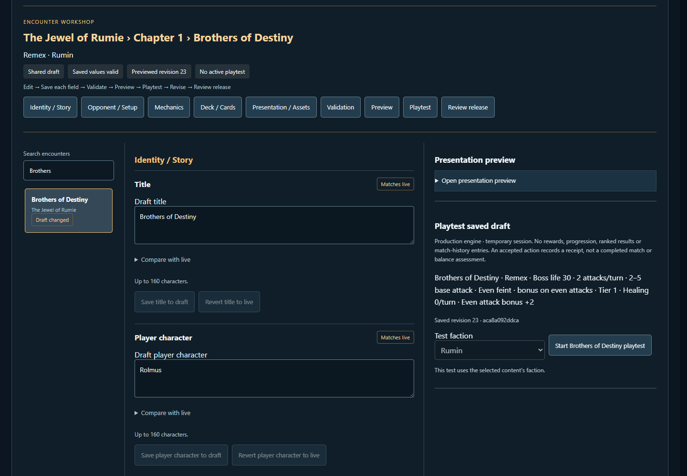
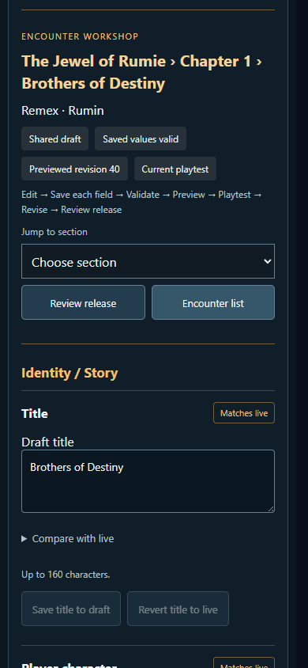
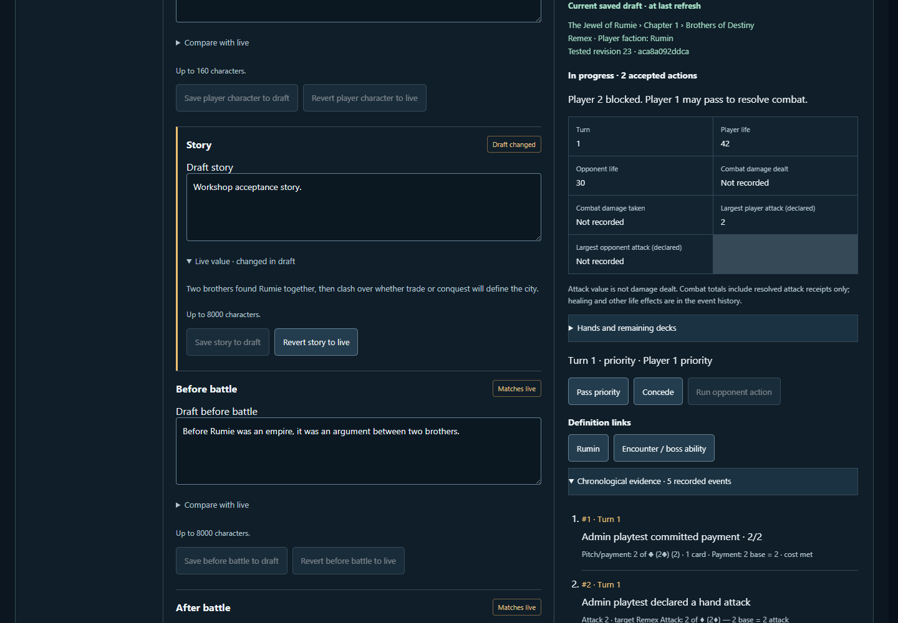
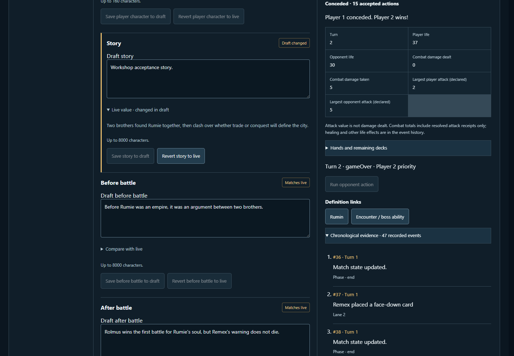

# Gauntlet UX audit and implementation plan

Audit date: 2 October 2026. Baseline: `20cb884422e68c652f893847ce9dece73ac47996`. Branch: `codex/gauntlet-ux-audit`.

## Scope and evidence

This is an audit of the existing product, followed by a small clarity pass. It is not a visual redesign. The plan below was written before changes to application code. Larger workflows remain proposed work; no new engine behavior, content release, permissions system, uploader or storage system is part of this pass.

Production inspected in Edge at <https://gauntlet-online.vercel.app/> and `/admin/gauntlet`, signed in as simply. Production remained read-only. The running backend reports the baseline commit above. It still reports **authoring connection required**, **account-only match persistence**, and **canonical archive unavailable**. One recent abandoned match was available for inspection: archive unavailability does not mean there are no records. Connecting the publishing credential is an operational dependency, not something a UI change can fix.

An isolated local production build at port 3117 with the disposable Admin server at 4117 was used for writes. Four existing browser tests passed before implementation: both allowed accounts/guest/visitor access; edits across campaign, card, encounter and mode; validation and preview; publication and rollback; encounter mechanics and accepted engine action; immutable artwork previews. Local publishing uses the file provider, so it verifies the interaction and content gates, **not a real GitHub merge/deployment**. Existing GitHub publisher code was reviewed for that distinction.

Manual player walkthrough: fresh home; Practice; faction lobby; choosing Rumin; local AI battle; select a 6-value attacker and 6-value payment; confirm, inspect opponent block, resolve (opponent 42 → 38 life); open chronological log; concede through confirmation; inspect Defeat and open replay. Production campaign map/briefing and existing deck workshop were inspected without saving. Desktop and 390 × 844 layouts were inspected. Automated accessibility is sampled, not a substitute for a full screen-reader or device study.

### Workflow coverage

| Surface / task | Current behavior and evidence |
| --- | --- |
| Overview | Counts and available modes are useful; versions appear before tasks. Every count currently opens the same Content landing state. Baseline desktop/mobile screenshots below. |
| Content: find encounter | Content → Encounters → search/name → inspect. 56 entries; no campaign filter or stable object link. Name and ID search work. |
| Edit mechanics / card / faction | Per-field Live/Draft comparison, typed finite contracts, explicit save, protected derived fields. Local tests changed boss life, card name, campaign text and faction artwork. Source review confirms supported faction effects remain contract-limited. |
| Choose assets | Text field/datalist of immutable IDs; preview loads correct artwork. The Assets tab contains 252 collector-presentation records, while the selectable asset manifest has 1,191 references. These are different counts. |
| Validate / preview | Shared saved revision, global and field errors; presentation preview below editor. Preview does not execute mechanics and disables battle launch/audio. |
| Engine playtest | Separate section below all fields. One accepted action records the publication receipt. The test faction control can display a faction different from the request. No compact final analysis. |
| Publishing / rollback | Local round trip succeeded and preserved match evidence. Name required, preview/mechanical-action gates, confirmation. Production additionally waits for GitHub checks, merge and deployment. Diff rows are raw IDs and field values. |
| Game | Mode copy and shared hand size editable; starting engine state is raw JSON. Runtime boundaries must remain explicit. |
| Players | Read-only identity/progress/decks/references, 25 accounts per page. Filter applies only to loaded page. No matching-filter message. |
| Matches | Recent window plus exact-ID lookup; participants/results and original evidence accessible. Live abandonment reason visible. Versions/IDs dominate and chronology uses event keys/Player 1. |
| System | Useful operational warnings, schema versions and source boundaries. Archive import within legacy operations can write after confirmation, despite the top-level Read-only badge. |
| Home / modes | Five meaningful player areas; Basic vs AI versus Factions vs AI is clear. Approved account has no Admin entry on a fresh home load. Multiple introductory recommendations can compete. |
| Faction / deck | Lobby distinguishes viewing from choosing; confirms before start. Workshop has 52 exact slots, matching replacements, full rules, zoom, saved versions and compact/cards toggle. Preserve these. |
| Campaign | Five campaigns, including XenDra (8 chapters), are present. Home still promises four twelve-chapter campaigns. Briefing exposes life/tempo/values, boss rule and first-clear reward; mobile battle action follows long dialogue. |
| Battle / legal choices | Payment meter, explicit commitment preview, disabled-lane reasons, priority plates and response text already exist. Logs show payment, attack, block and numerical resolution. Do not replace these with generic notifications. |
| Result / progression / replay | Defeat has reason, credits and next actions; raw match UUID is prominent. Campaign map has clear cleared/unlocked gates; account completion refresh has existing guards. The recorded local battle opened a seven-action replay with named actors, previous/next, timeline and speed controls; unsupported/missing evidence must stay explicit. |

### Baseline constraints

`npm run check:bundle`: main **176.0 / 177.0 KiB**, player JavaScript **734.9 / 736.0 KiB**, lazy Admin **15.5 / 18.0 KiB**, largest async **292.0 / 350.0 KiB** (gzip). The brief's 702.5/704 and 906 references describe an older build. This pass uses the checked-in budgets and the current 1,191-reference manifest; it does not increase budgets.

Admin remains behind the server's two stable account IDs. The home navigation may ask the existing access endpoint whether to show a link; the server remains the authority for every Admin request. No display-name allowlist is added.

## A. Critical usability problems

### A1. Approved operators cannot discover Admin from a fresh home

- **Current:** `/admin/gauntlet` works, but home only reveals “Studio / Owner operations” after authorization inside that surface in the same session.
- **Problem:** An approved operator must remember a URL; the two names imply different tools.
- **Change:** Ask the existing server access endpoint on sign-in, show **Admin / Content and operations** only after approval, immediately hide on account change/sign-out and ignore stale responses. Both Close admin and Back to Gauntlet return to the player menu without losing the entry. Keep the direct route's access screen and lazy loading.
- **Files:** `client/src/App.js`, `HomeNavigation.js`, small `useAdminAccess.js` hook and tests; `Studio.js` gate and close callback.
- **Benefit:** Reliable entry without broadening access.
- **Complexity:** Small. **Gameplay/data risk:** Low; navigation only, but stale-session behavior requires tests.
- **Disposition:** Implement in this pass.

### A2. Connection and draft states do not explain the next action

- **Current:** Production disables edit fields, shows a permissions paragraph, and enables Validate with no draft. Empty lists can look like failed loading.
- **Problem:** Operators may think validation enables publishing or that content disappeared. The warning does not say what the operator can do now.
- **Change:** Lead with “Browsing live content. Saving and publishing are unavailable”; tell the hosting administrator to connect GitHub and the operator to refresh. Put credential variable/permission details in an expandable setup section. Disable draft validation without a draft; provide an explicit no-results state.
- **Files:** `GauntletAuthoring.js`, `GauntletAdmin.js`.
- **Benefit:** Separates an operational blocker from a content error; makes recovery discoverable.
- **Complexity:** Small. **Gameplay/data risk:** Low; existing server gates unchanged.
- **Disposition:** Implement copy, no-draft control and empty states. Operational credential setup remains external.

### A3. Playtest faction and completion wording can mislead

- **Current:** A row's faction overrides the “Test faction” dropdown. The success message says a playtest is recorded after one action, even when no match has finished. An old session can remain visible while another row/draft is selected.
- **Problem:** The operator can believe they tested a chosen matchup or completed encounter when they did neither.
- **Change:** Display the effective faction and disable the overridden selector with an explanation. Say the receipt records an accepted engine action and does not establish completion/balance. Follow-up: pin encounter, faction and draft context in each session header and mark a session stale when the draft changes.
- **Files:** `GauntletPlaytest.js`, `server/adminPlaytest.js` (context projection for follow-up), `GauntletAuthoring.js`.
- **Benefit:** Trustworthy test setup and evidence.
- **Complexity:** Small for selector/copy; medium for session-context follow-up. **Gameplay/data risk:** Low for implemented UI; medium for future session lifecycle work. Do not change receipt policy silently.
- **Disposition:** Implement selector/copy only. Session context is a concrete next task.

### A4. Confirmation and unsaved-form navigation need complete coverage

- **Current:** Authoring confirms leaving some sections, but outer Back to Gauntlet/close/refresh can unmount buffers; confirmation is an inline section far below a long diff/history and receives no focus.
- **Problem:** A clicked dangerous action can appear unresponsive; operators can lose unsaved typing without a consistent warning.
- **Change:** First, focus and scroll the existing confirmation region, return focus on Cancel, give it a clear accessible name. Next task: centralize unsaved-form guarding across every exit and refresh, without confusing locally typed values with the durable shared draft.
- **Files:** `GauntletAuthoring.js`, `GauntletAdmin.js`, `Studio.js`, `App.js`.
- **Benefit:** Makes confirmation reviewable and protects editing intent.
- **Complexity:** Small focus fix; medium exit guard. **Gameplay/data risk:** Low for focus; medium for exit flow because stale/shared revision handling must remain intact.
- **Disposition:** Implement confirmation focus only; broader guard remains planned.

### A5. Mobile battle information competes for the same space

- **Current:** At 390 × 844 the swipeable hand and payment/confirm panel remain usable with no page overflow. The play-order strip overlaps part of the opponent plate; opponent hand/deck counters visible on desktop are absent from the compact visual plate (still present in its accessible name).
- **Problem:** Strategically relevant opponent state is harder to see before committing; a screen-reader name alone does not help a sighted player.
- **Change:** Reserve a compact opponent summary row with life, hand, deck and priority. Fit the one-line latest-event strip below it, with full history one tap away. Keep payment amount, selected cards, response opportunity and confirm/cancel visible together. Test short-height landscape as well as phone portrait.
- **Files:** `babylon/ProductionMatchExperience.jsx`, `.css`, existing `e2e/babylon-live.spec.js`.
- **Benefit:** Decisions use visible state instead of memory.
- **Complexity:** Medium. **Gameplay/data risk:** Medium presentation risk; do not change legal-action derivation or hide buffs/stack state.
- **Disposition:** Planned; requires layout comparison across combat phases.

## B. High-value workflow improvements

### B1. Encounter Workshop — the next main Admin project

- **Current:** A generic per-field form spreads story, setup and references down a long page; preview and playtest are at the bottom; publishing is another section.
- **Problem:** Find → edit → test → understand → revise loses context and requires scrolling/page hopping.
- **Change:** Build the workspace specified below using the same save/validation/preview/playtest/release endpoints. Preserve finite typed contracts; no arbitrary engine editor.
- **Files:** `GauntletAuthoring.js`, `GauntletContractFields.js`, `GauntletPlaytest.js`, `GauntletAdmin.css`; new lazy `EncounterWorkshop` and small result projection.
- **Benefit:** Shorter iteration loop and fewer accidental tests of the wrong draft.
- **Complexity:** Large. **Gameplay/data risk:** Medium; no engine change, but draft identity, unsaved state and receipt invalidation must be preserved.
- **Disposition:** Planned as the strongest near-term workflow, not implemented speculatively.

### B2. Match inspector should explain the sequence and its source

- **Current:** Original events and public payloads are available, but mostly in technical rows. No event filters or direct content navigation; replay is mentioned without a direct link here.
- **Problem:** “What happened, why, and which definition caused it?” takes manual ID translation.
- **Change:** Result/participants/final life first; a readable chronological list with Turn, Combat, Abilities, Resource/payment and Completion filters; expand each event for exact evidence. Map actors/card names from recorded snapshots before current catalog. Provide Open encounter/card/faction and existing public replay links, clearly identifying current versus recorded content.
- **Files:** `GauntletAdmin.js`, `server/adminData.js`, `matchRecords.js`, existing `babylon/ReplayTranscript.jsx` and match log projections.
- **Benefit:** Designers can trace a surprising result to content without rewriting history.
- **Complexity:** Medium. **Gameplay/data risk:** Medium interpretation risk. Unknown IDs remain visible; incomplete evidence must never produce invented explanations.
- **Disposition:** Implement only grouping of technical details now; chronology/navigation follow-up.

### B3. Publishing needs a human release review

- **Current:** Flat domain/ID/field diffs, full hashes, several independent disabled controls. Mechanical changes require an accepted action, and GitHub publication waits for checks/merge/deployment.
- **Problem:** Operators cannot quickly assess scope, readiness or whether “published” is actually live.
- **Change:** A grouped release summary and explicit readiness sequence described below; human object names and detailed expandable field comparisons; reviewable rollback changes. Preserve every gate and concurrency check.
- **Files:** `GauntletAuthoring.js`, `server/contentPublication.js`, `server/githubContentPublication.js`, existing publication tests.
- **Benefit:** Safer publishing with clear timing and impact.
- **Complexity:** Medium. **Gameplay/data risk:** Medium; incorrect readiness or rollback summaries could mislead. Backend remains decisive.
- **Disposition:** Only technical disclosure/copy in this pass; full flow planned.

### B4. Content relationships and impact

- **Current:** Definitions expose IDs and references but do not present a relationship graph.
- **Problem:** A card, opponent, faction or asset change can affect other encounters without obvious context.
- **Change:** Derive read-only indexes from each resolved live/draft snapshot: **Used by** decks/encounters for cards; **Appears in** encounters for opponents; **Part of** campaign/faction; **References** art/audio/cards. Show impact counts and named links; compare live and draft edges. Label incomplete/dynamic engine references rather than claiming exhaustive coverage.
- **Files:** `server/adminData.js`, authored snapshot/resolver, `GauntletAuthoring.js`, future Workshop.
- **Benefit:** Operators see likely consequences before saving/releasing.
- **Complexity:** Medium. **Gameplay/data risk:** Low if derived/read-only; medium if completeness is overstated.
- **Disposition:** Planned. No second mutable relationship database.

### B5. Visual asset picker

- **Current:** 1,191 manifest references offered through text datalists; Assets tab's 252 rows are collector presentations. Hashes and paths are stable but poor discovery tools; preview audio is disabled.
- **Problem:** Choosing the right portrait, card illustration or voice requires knowing filenames.
- **Change:** Lazy picker filtered by image/audio and applicable field; search source/name/faction; paginated thumbnails; selected image at useful size; user-initiated audio controls with duration when available. Show Used by, current/draft side by side, and expandable immutable identity/digest/source. Preserve manual ID entry as Advanced. Rename/explain the Assets tab's scope. No uploader.
- **Files:** `GauntletAuthoring.js`, asset manifest projection, `GauntletAdmin.css`, existing asset resolver.
- **Benefit:** Confident visual selection without weakening immutable references.
- **Complexity:** Medium. **Gameplay/data risk:** Low; reference validation unchanged. Do not autoplay or fetch every asset on entry.
- **Disposition:** Planned, before further asset authoring expansion.

### B6. Deck learning and selection context

- **Current:** Exact slot swaps, matching-card filtering, resizable preview, full rules, zoom and saved versions already work. Build recommends Play with friends even when editing is the user's immediate intent; lobby selection is separate.
- **Problem:** New players must connect owned cards → legal slots → active deck → game themselves. Compact card wording can require expansion to understand a trigger.
- **Change:** Retain slot workflow; add a concise active-deck/faction summary at mode confirmation and direct Edit deck return path. Explain zero replacements as a playable standard deck; keep full rules/keywords available before a swap.
- **Files:** `App.js`, `DeckWorkshop.js`, `DeckLibraryPanel.js`, lobby components.
- **Benefit:** Makes deck consequences understandable without replacing the successful workshop.
- **Complexity:** Medium. **Gameplay/data risk:** Medium; preserve selected general, saved version and mode-specific deck eligibility.
- **Disposition:** Planned; preserve current set-specific Sealed and commander announcer behavior.

## C. Readability / information hierarchy

### C1. Technical details dominate task summaries

- **Current:** Overview begins with content/rules IDs; match detail mixes result with checksum/provenance; Publishing repeats hashes in release history; selected objects show file paths before fields.
- **Problem:** Operators must scan infrastructure identifiers before the task or outcome.
- **Change:** Use native **Advanced / Technical** disclosures for exact versions, IDs, source paths and checksums. Keep result, integrity/coverage warnings and live/draft status visible. System remains the dedicated technical workspace.
- **Files:** `GauntletAdmin.js`, `GauntletAuthoring.js`, `GauntletAdmin.css`.
- **Benefit:** Less clutter without losing diagnostic evidence.
- **Complexity:** Small. **Gameplay/data risk:** Low; original values remain available and unmodified.
- **Disposition:** Implement on Overview, selected content, match detail and Publishing. Wider record-table redesign remains B2.

### C2. Editable controls need semantic grouping

- **Current:** Story text, presentation references and mechanics share one long list. Object parameters include labels such as Attack progression offset and Boss Ability Id; protected Version/Attack Timing inputs look like ordinary disabled fields.
- **Problem:** “What can I change and what does it do?” is only partially answered by a global paragraph.
- **Change:** Label authoring as shared draft; explain saved versus live before controls. Group story, presentation and mechanical contracts in B1; display protected contract identity as text in Technical, and add schema-owned units, limits and effect descriptions to supported parameters. Do not invent meanings from variable names.
- **Files:** `GauntletAuthoring.js`, `GauntletContractFields.js`, server authoring field definitions.
- **Benefit:** Safer mechanical edits and less guesswork.
- **Complexity:** Medium. **Gameplay/data risk:** Medium if helper text is inaccurate; test against contract definitions.
- **Disposition:** Plain global copy now; schema-aware grouping planned.

### C3. Searches and count navigation need honest scope

- **Current:** Player filter scans only 25 loaded accounts; match search scans a recent window; counts on Overview all open default Content. Empty filtered content/player lists have no explanation.
- **Problem:** “No match here” can be confused with “not in the system”; count buttons imply a destination they do not provide.
- **Change:** Route count buttons to their content type. Show “No … match this search” and clearing/paging guidance while retaining scope text. Future task: server-backed account search if the account list warrants it, without exposing new private fields.
- **Files:** `GauntletAdmin.js`, `GauntletAuthoring.js`; future `server/adminData.js` search.
- **Benefit:** Predictable navigation and useful empty states.
- **Complexity:** Small now; medium server search. **Gameplay/data risk:** Low.
- **Disposition:** Implement count routing and no-results copy only.

### C4. Home campaign copy is stale

- **Current:** Guest home promises four factions/four twelve-chapter campaigns; its accessible strip label also says four. Actual map includes five campaigns, XenDra with eight chapters.
- **Problem:** Visible and spoken instructions contradict the product.
- **Change:** Use count-neutral truthful copy (“Choose a faction campaign”) rather than another hard-coded count; keep actual progress computed from content.
- **Files:** `App.js`.
- **Benefit:** Consistent navigation for new players and assistive technology.
- **Complexity:** Small. **Gameplay/data risk:** None; copy only.
- **Disposition:** Implement.

### C5. Player outcome and campaign briefing can be more concise

- **Current:** Result prominently lists Match ID; briefing repeats story in hero/body and can place Begin Battle below long dialogue on phone. Outcome offers several equally weighted next actions.
- **Problem:** Player intent (retry, next chapter, understand loss) competes with record metadata and repeated prose.
- **Change:** Lead result with outcome, opponent, final life and earned/pending progression from existing completion data; put record ID in details. Give next chapter/retry appropriate prominence, with replay/history secondary. On briefing retain boss mechanics/objective/reward above commitment; fold repeated lore, not strategic rules.
- **Files:** `babylon/ProductionMatchExperience.jsx`, `match/completionResultProjection.js`, `CampaignChapterBriefing.js`, `App.js`.
- **Benefit:** Clearer next action and consequences before battle.
- **Complexity:** Medium. **Gameplay/data risk:** Medium; never infer a victory reward or progression completion while the server receipt is pending.
- **Disposition:** Planned; needs comparison of win/loss/draw/abandoned/campaign states.

### C6. System's read-only badge overstates its boundary

- **Current:** System says Read-only inspection, but expanded legacy archive recovery can import after preview/confirmation.
- **Problem:** A user may assume every control there is harmless inspection.
- **Change:** Label System “Diagnostics and recovery”; retain the existing explicit write warning next to imports. Distinguish live-content validation success from operational authoring/archive warnings.
- **Files:** `GauntletAdmin.js`, existing `Studio.js` recovery tools.
- **Benefit:** Truthful operation boundaries.
- **Complexity:** Small. **Gameplay/data risk:** Low; no change to import behavior.
- **Disposition:** Implement badge only; deeper diagnostic summaries follow later.

## D. Visual polish

### D1. Consolidate small native Admin patterns

- **Current:** Good dark/gold identity and visible focus outlines; repeated form, disclosure, warning and action-row markup with dense 11–13px metadata. Button minimum height is 40px.
- **Problem:** Equal-weight controls and dense rows slow scanning; small touch targets increase effort.
- **Change:** Preserve colors and typography family; use consistent native disclosure, note, status and confirmation styles. Raise Admin button touch height to 44px, allow long labels to wrap and give disclosures usable padding. Avoid a new component library.
- **Files:** `GauntletAdmin.css`, small existing Admin components.
- **Benefit:** More consistent keyboard/touch use with negligible JS cost.
- **Complexity:** Small. **Gameplay/data risk:** Low; verify mobile wrapping.
- **Disposition:** Implement restrained touch/disclosure styling only.

### D2. Accessibility and responsive regression matrix

- **Current:** Existing Admin axe checks and phone overflow checks pass; game has keyboard controls, explicit accessible names, reasons and modal support. Most broad tables still scroll horizontally.
- **Problem:** A passing axe scan does not prove focus is moved correctly, all controls fit, or a long form is pleasant on touch.
- **Change:** Preserve all existing coverage; add keyboard confirmation/cancel focus, collapsed/expanded technical evidence, stale access response/sign-out, effective faction and empty-state checks. Follow-up: caption/row header and named keyboard-scroll region for tables, filter scope announcements, 200% zoom, keyboard-only full workflows and an actual screen-reader session.
- **Files:** `e2e/admin.spec.js`, new focused UX tests, Admin CSS; existing Babylon/workshop tests.
- **Benefit:** Verifiable usability improvements instead of screenshot-only approval.
- **Complexity:** Small targeted checks; medium full matrix. **Gameplay/data risk:** Low.
- **Disposition:** Targeted checks now; broad assistive-tech study remains planned and unclaimed.

## E. Longer-term ideas

### E1. Compare test runs and explain balance trends

- **Current:** Private Admin playtests are temporary and intentionally do not write canonical history or rewards.
- **Problem:** Designers cannot compare iterations after sessions expire.
- **Change:** Only after B1's summary is useful, consider explicitly exported local run reports containing draft identity, setup, commands and observed metrics; later decide whether a separate design-test store is warranted. No automatic promotion into real match history.
- **Files:** Future Workshop/report projection, `adminPlaytest.js`.
- **Benefit:** Repeatable design learning without contaminating player evidence.
- **Complexity:** Large. **Gameplay/data risk:** Medium; report provenance and reproducibility need design. **Disposition:** Deferred product decision.

### E2. Deep links, navigation memory and user testing

- **Current:** Admin section/selection/filter are local component state; direct route opens Overview. Player navigation spans menu, collection, campaign and public match views.
- **Problem:** Refresh and sharing context lose an operator's place; proposed improvements have not been evaluated with unfamiliar users.
- **Change:** Versioned safe URL state for section/domain/object, then measure time-to-find encounter, time-to-explain combat and time-to-review release with the two operators and new players. Keep permissions enforced on every fetch; do not serialize credentials or draft field values into URLs.
- **Files:** `App.js`, `GauntletAdmin.js`, authoring navigation; lightweight research protocol.
- **Benefit:** Reliable return paths and evidence for later visual decisions.
- **Complexity:** Medium. **Gameplay/data risk:** Low to medium navigation/privacy risk. **Disposition:** Deferred until core workflow settles.

## Encounter Workshop specification (B1)

Desktop: a compact search/campaign list on the left, one selected encounter workspace in the center, and a bounded Preview/Test panel on the right. Mobile: list → selected encounter with a visible context/back row and in-page section links; avoid three nested scroll containers. Use existing Gauntlet dark/gold treatment, not a grid of equally prominent cards.

Context header: **Campaign › Chapter number › Encounter name**, opponent, **Live / shared draft / unsaved form**. Selected identity never changes invisibly when another domain is opened. A compact action row shows Save changed fields (if batch saving is designed), Validate, Preview, Start test and Review release; current per-field save remains until atomic batch semantics are specified.

1. **Identity / story:** title, before/after narrative, dialogue; live-vs-draft for changed fields.
2. **Opponent / setup:** named opponent, player faction, life, attack tempo/value range, encounter deck plan; identity and engine-only settings clearly read-only.
3. **Mechanics:** supported boss ability and typed parameters with units/defaults/limits from the contract; explanatory rule text adjacent. No arbitrary JS, JSON handler editing or hidden effect substitution.
4. **Deck / cards:** named slot replacements and quantities, links to card definition/rules and reverse usage.
5. **Presentation / assets:** image/audio picker (B5), old/new preview, usage context, advanced immutable identity.
6. **Validation:** field links with errors first; warnings separate; last saved revision tested/previewed shown. Editing invalidates stale readiness exactly as the server does.
7. **Playtest:** setup summary, effective faction, encounter, saved draft identity and temporary-session notice. Keep start/restart explicit; old sessions must visibly identify the snapshot they use.

Post-test panel: **In progress / Victory / Defeat / Draw / Conceded**, turn count, each player's final/current life. Report damage and largest attack only when authoritative emitted events support them; otherwise show **Not recorded**, never zero. List relevant cards/abilities and a compact sequence of important events. Keep attack value separate from damage actually dealt and preserve mitigation/response context. Link known content IDs to its authoring panel and retain raw engine evidence in Technical. One accepted action should be labeled **Engine action checked**; a completed-match summary is a separate fact and is not proof of balance.

Acceptance: edit one encounter's story, mechanics and art; validate; preview; run a meaningful turn; inspect result; revise; review publication without losing encounter context. Test invalid field, stale draft, session expiry, second operator revision conflict, phone layout and keyboard navigation. Estimated extra gzip: **2–4 KiB Admin-only**, potentially over the present 18 KiB cap; measure first and split/reuse projections before adding UI. Never increase the cap simply to pass.

## Match chronology and content links (B2)

Summary order: result/reason → named participants/factions/final life → encounter/mode/turns when recorded → evidence availability/integrity → chronology. Each row shows turn/phase, actor name, action, immediate observed consequence and source card/ability. Expand for original sequence/timestamp/payload. Filters hide presentation rows only, not mutate or reorder stored evidence. “Why” describes recorded calculation inputs, not a guessed causal narrative.

A current-content link must say **Open current definition** when no historical authored snapshot is available. A missing/deleted/unknown ID remains inspectable in Technical. Public replay links must respect existing availability and never promise hidden hands or a reconstruction from insufficient evidence. Expected incremental gzip **1–2 KiB lazy Admin**, preferably reuse existing pure projections without importing the 3D renderer into Admin.

## Release review and rollback specification (B3)

Readiness strip: **Saved draft → Validation → Presentation preview → Engine action checked (mechanical changes only) → Ready to publish**. Display the next unmet prerequisite in words, including unsaved local form values. A receipt invalidated by a new draft must not remain green. Do not imply the action receipt is a completed playthrough.

Summary example (illustrative, not this release): **2 encounters, 3 card definitions, 1 faction parameter, 4 asset references changed; game configuration unchanged**. Count unique objects per domain and reference fields separately, avoid adding field counts and object counts together. Names lead; IDs remain drill-down. Expand a group for fields with old/new values and story/mechanics/presentation classification from schema metadata, plus known affected uses (B4).

Publish confirmation names the release, counts changes and says existing games retain captured content. After request: **Waiting for checks → Ready to merge / blocked → Deploying → Live**, mapped to actual provider phases; failure gives a next action and the existing GitHub link. Keep “deployed live” distinct from a successful save/merge.

Rollback: choose a named compatible release; preview the difference **from currently live to target**, timestamp, target label, pending/shared-draft blocker and future-games-only consequence; confirm the named target. Keep full release IDs/digests expandable. A rollback via GitHub uses the same checks/deployment gate; do not imply instant activation. Expected extra gzip **1–2 KiB lazy Admin**; no diff library necessary for structured fields.

## Prioritized implementation sequence

1. **This pass — small clarity fixes:** A1 access-aware Admin link; A2 connection/no-draft/empty copy; A3 effective faction and receipt wording; A4 confirmation focus; C1 technical disclosures; C3 count destinations; C4 campaign copy; C6 truthful System badge; D1 touch/disclosure consistency. Estimate ≤0.7 KiB main and ≤1.5 KiB Admin gzip; verify actual totals before completion. No new dependencies.
2. **Protect editing context:** finish A4's exit/refresh guard and A3's pinned-session header. Acceptance covers unsaved form vs saved shared draft, stale response, second operator and session expiry.
3. **Encounter Workshop vertical slice:** B1 with a single encounter from search through test and revision. Reuse player briefing/card components. Implement result facts only from available evidence; keep session/run identity explicit.
4. **Release review:** B3 grouped summary/readiness/rollback preview, preserving GitHub gates. Test all provider phases and incompatible/stale target behavior.
5. **Relationships and visual assets:** B4 derived usage first, then B5 so picker impact/usage are grounded. Lazy thumbnails and on-demand audio; estimated picker cost 1–2 KiB Admin plus only requested media.
6. **Design/debug inspector:** B2 chronology and content/replay links. Test incomplete records and old content rather than assuming today's definitions explain yesterday's match.
7. **Player decisions on phone:** A5 information placement, then C5 briefing/result hierarchy and B6 deck return paths. Retain all legal-action/payment/buff/trigger/stack details. Estimated ≤1 KiB player JS if using existing projections/CSS; current headroom requires measured savings first if exceeded.
8. **Broader accessibility and research:** D2 full matrix, E2 navigation/user study, then E1 only if operators need persistent comparisons.

## Baseline screenshots

These are local fixture data, not live player records. Full-page baseline captures are intentionally retained as evidence of density; comparison captures use the same views. The later Overview additionally contains the local audit's conceded practice match, and timestamps differ.

- [Overview desktop](ux-audit/before/admin-overview-desktop.png)
- [Overview mobile](ux-audit/before/admin-overview-mobile.png)
- [Card editor desktop](ux-audit/before/admin-content-desktop.png)
- [Publishing desktop](ux-audit/before/admin-publication-desktop.png)

## Implementation and verification record

Completed locally on `codex/gauntlet-ux-audit`. No push, merge, content publication to production or deployment was performed for this UX pass. The previous Admin release remains live. Original working files outside this managed worktree were not changed.

### Implemented before / after

| Item | Before | After | Screenshot |
| --- | --- | --- | --- |
| A1 | Fresh home has no operator entry; “Studio” only after visiting Admin. Close admin returns to its gate. | Server-approved account sees **Admin / Content and operations**. Both exit controls return to the player menu. Guest/visitor/sign-out hide the entry. | [Home navigation](ux-audit/after/admin-ux-navigation.png) |
| A2 / C3 | No-draft validation appears enabled; failed searches leave an empty list; connection warning leads with permissions. | Validation disabled until a writable saved draft exists; search explains no matches and scope; warning explains browsing-only state, hosting-admin action and Refresh. Credential details expandable. | [Disconnected desktop](ux-audit/after/admin-ux-disconnected-desktop.png), [phone](ux-audit/after/admin-ux-disconnected-mobile.png) |
| A3 | Selector can show Rumin while selected Sheen content actually starts Sheen. A recorded action sounds like a completed test. | Effective faction is displayed and locked to selected content, including campaign-only factions. Generic duels still honor selection. Receipt explicitly means one accepted action, not a completed match/balance assessment. | [Effective Sheen test setup](ux-audit/after/admin-ux-playtest.png) |
| A4 | Inline confirmation can be far below the trigger with unchanged keyboard focus. | Confirmation scrolls into view and receives focus; Tab reaches confirm/cancel; Cancel restores trigger focus. Publication names the target and states GitHub deployment timing. | [Confirmation](ux-audit/after/admin-ux-confirmation.png) |
| C1 | Hashes/source paths occupy primary summary space. | Overview, selected content, match provenance and release identities use **Advanced / Technical** disclosures. Match result/integrity/coverage remain visible. | [Overview before](ux-audit/before/admin-overview-desktop.png) / [after](ux-audit/after/admin-overview-desktop.png); [editor before](ux-audit/before/admin-content-desktop.png) / [after](ux-audit/after/admin-content-desktop.png); [publishing before](ux-audit/before/admin-publication-desktop.png) / [after](ux-audit/after/admin-publication-desktop.png) |
| C2 / C3 | Generic authoring instructions and count buttons all lead to default Content. | Plain shared-draft/save copy, selected type/name context; count buttons open the correct content type. | [Card editor](ux-audit/after/admin-content-desktop.png) |
| C4 / C6 | Home promises four twelve-chapter campaigns; System says all read-only. | Count-neutral campaign copy; System says **Diagnostics and recovery** while preserving archive-import warning. | Covered by source review and existing section checks. |
| D1 / D2 | 40px Admin buttons, compact disclosures, no confirmation focus test. | 44px minimum buttons/disclosures, native focus behavior retained; new access/faction/focus/mobile-state checks. | [Overview phone before](ux-audit/before/admin-overview-mobile.png) / [after](ux-audit/after/admin-overview-mobile.png) |

### Verification

- **578 client tests passed across 67 suites**, including new late-account-response, denied/network access and effective-faction tests. After the final close-navigation adjustment, the 10 Studio/access tests passed again.
- **6 Admin browser tests passed** on the final production build. Existing four tests retained and expanded; two added for home discovery/sign-out/count routing/search/confirmation keyboard flow and a deliberately simulated disconnected authoring response. Both allowed accounts still work; visitor and guest server denial remains tested.
- Existing axe checks retained; the added 390 × 844 disconnected editor check passes axe and page-overflow assertions. Technical sections were expanded during testing to verify their values remain readable.
- Preview/publish/rollback and mechanics round trips passed against isolated local content. Existing match evidence was unchanged by content publication/rollback. Immutable asset preview checks still pass.
- Production build compiled successfully. `git diff --check` passes. No dependencies or engine/server content files changed.
- The first browser rerun found an ambiguous old “Inspect match” selector because this audit had created another local match. It now selects the seeded fixture's exact ID; all six tests subsequently passed. No application failure was hidden by reducing assertions.
- Windows CRA/Jest's default absolute glob matched no tests in this worktree. Verification used its equivalent relative `--testMatch '**/*.test.[jt]s?(x)'` override; no test was skipped to obtain the totals.

Reproduce: `npm run test:e2e:admin`; `npm run build:client`; `npm run check:bundle`. On this Windows checkout: `npm --prefix client test -- --watchAll=false --runInBand --testMatch '**/*.test.[jt]s?(x)'`. Browser tests write fresh screenshots under ignored `artifacts/`; the reviewed captures are copied into `docs/ux-audit/`.

### Measured bundle impact

| Gzip metric | Before | After | Existing ceiling |
| --- | ---: | ---: | ---: |
| Main entry | 176.0 KiB | 176.2 KiB | 177.0 KiB |
| Player JavaScript | 734.9 KiB | 735.0 KiB | 736.0 KiB |
| Lazy Admin JavaScript | 15.5 KiB | 16.3 KiB | 18.0 KiB |
| Largest async chunk | 292.0 KiB | 292.0 KiB | 350.0 KiB |

Values are rounded by the existing budget checker. The access discovery hook is the only new player-side behavior; Admin components remain lazy. There are no new packages. Screenshot/document files do not enter the client bundle. Budget constants are unchanged.

### Remaining work and limits

B1–B6, A5, the wider unsaved-exit/session-context work and broader screen-reader/zoom/device study remain proposed tasks. This pass does not claim to have implemented the Encounter Workshop, grouped release diff, visual asset browser, relationship index or a completed-playtest analysis. Keep the sequence above rather than expanding generic editing controls further.

The manual battle was a representative attack/block/payment/concession/replay path, not a fresh qualification of every faction effect, stacked response, multiplayer mode or campaign reward. Those projections and rule tests were preserved; targeted player layout follow-up needs adversarial phase/response cases. No assistive-technology certification is claimed.

Live GitHub authoring remained disconnected at inspection, and live full match durability remained degraded. The local successful release round trip cannot establish that production saving or durable archiving is configured. No credentials were created, copied or changed during this audit.

## Encounter Workshop implementation — 2 October 2026

This section supersedes the earlier “remaining work” entry for the Encounter Workshop and editing/session context. The original audit above is retained as the baseline.

### Layout and editing flow

Encounters now have a dedicated three-column desktop workspace: searchable encounter list, grouped editor, and presentation preview / production-engine playtest. At medium widths testing follows the editor; on phones the list opens the selected encounter and its in-page sections. The workshop uses the page scroll, not a second scrolling editor. Campaign, chapter, encounter, opponent, faction and readiness appear together at the top. Other content types retain their existing editors.

The editor groups Identity / Story; Opponent / Setup; Mechanics; Deck / Cards; Presentation / Assets; and Validation. Unchanged live values are expandable, changed text shows its live comparison, and raw setup/identity data lives under Technical. Boss abilities have human labels and bounded controls sourced from the same bounds used by server validation. Optional healing and even-attack bonuses are available without arbitrary JSON. Card additions show names, one-copy slots, faction restrictions and rules text, with links to their definitions. Scene and voice references have media previews. Opponents have no separate portrait field in the current contract; the available faction commander portrait is explicitly identified and linked to its own definition.

The existing CampaignChapterBriefing and card components provide saved presentation previews. The engine playtest remains a separate operation. “Review release” opens the existing Publishing screen with a return link to the selected encounter. Opening a card, faction, opponent or encounter definition preserves the encounter selection and the temporary session.

### State and evidence truth

- **Live:** the deployed content remains unchanged by field saves, previews and tests.
- **Shared draft:** saved values and a saved revision/hash are separate from live; each supported field still saves through the existing shared-draft API.
- **Unsaved:** local typing is marked separately. Content/section changes, Refresh, Close, Back and browser unload warn before loss. Cancel preserves values. Explicitly discarding local values never discards the shared draft.
- **Validated / previewed:** validation names the saved revision; preview records its revision and exact hash. Local values are never presented as validated or previewed. Saving clears the backend's existing readiness receipts.
- **Tested:** each session pins its original campaign/chapter/encounter, faction, opponent, setup, draft revision and hash. “Engine action checked” still means an accepted command, not a completed encounter or a balance assessment.

The server collects only committed production-engine events, after the existing exact-draft receipt succeeds. The panel shows In progress, Victory, Defeat, Draw or Conceded; the engine's current turn and both life totals; combat damage dealt/taken from resolved attack receipts; and each side's largest declared attack. Attack values are never substituted for actual damage. Missing receipts show **Not recorded**. An actual zero-damage resolution may show 0. Healing and noncombat life effects remain in chronological evidence rather than being mislabeled combat damage. Existing event formatting preserves payment, block, prevention, response and ability context. Exact known card references link to Admin definitions; basic cards and unknown sources are not guessed into catalog links. Full pinned state and recorded event payloads remain under Technical.

The visible log initially shows the latest 12 events and can expand to all retained events. It retains up to 2,000 events and explicitly reports any earlier omissions; session totals accumulate independently over all accepted events. These are temporary, in-memory sessions, not production match records or durable test reports. Starting a replacement asks before clearing the old session's evidence. Refreshing the entire browser or leaving Admin ends the local inspection context; the saved shared draft remains durable through the configured provider.

### Staleness, conflicts and isolation

A saved content-hash change marks the old session stale immediately on this client and disables commands while preserving its evidence. During an active session, the shared draft refreshes on window focus and every 30 seconds while visible and idle; status says “at last refresh.” The server independently rejects stale commands before advancing the game. Browser/API expiration is visible and requires a new session; server sessions expire after 30 minutes of inactivity. Backend restarts also require restarting a temporary test.

A conflicting save keeps local typing, loads the newer shared draft for comparison, and requires “Use latest revision for retry” before a deliberate resave. A background refresh does not silently update the original expected revision of an unsaved edit. Requests in flight block navigation until their result is known.

The real game factory, campaign preparation, AI and command engine are unchanged. There is no new simulator, reward path, progression, ranked/league result or production match persistence. The existing two-account server allowlist and publication/rollback checks remain in place. No account roles, mechanics, encounters or balance changes were added.

### Loading and scope

All Workshop UI remains inside the lazy Admin entry. Consolidating the two Admin chunks avoids duplicated compression overhead; instructional copy travels with the private authoring projection, and encounter help stays on the server. Numeric contract bounds remain shared with validation. No packages or budget ceilings were added or raised. A frontend arriving before its compatible backend displays an update-in-progress message instead of opening incomplete controls.

The larger asset browser, relationship graph, grouped release review, match inspector redesign and account repair tools remain separate work. Production authoring still depends on the backend's existing GitHub connection; deploying the Workshop cannot supply a missing runtime credential.

### Final Workshop verification and bundle impact

The release includes the earlier clarity pass and the Workshop, based on main `47516de` so the already-released readable deck-card layout is preserved.

- 580 client tests pass across 67 suites; 272 server tests pass; 37 qualification tests pass. Server verification on this Windows machine used one test worker to avoid socket resets under simultaneous builds.
- The content release validator preserves the baseline content hash, 126 card definitions and 1,191 references. Existing 56-encounter equivalence and 2,800-outcome checks pass. No balance or authored live-content changes are included.
- The production build and existing bundle checker pass without raising any limit. No dependencies were added.

| Gzip metric | After clarity pass | Final combined release | Existing ceiling |
| --- | ---: | ---: | ---: |
| Main entry | 176.2 KiB | 176.2 KiB | 177.0 KiB |
| Player JavaScript | 735.0 KiB | 735.1 KiB | 736.0 KiB |
| Lazy Admin JavaScript | 16.3 KiB | 17.7 KiB | 18.0 KiB |
| Largest async chunk | 292.0 KiB | 292.0 KiB | 350.0 KiB |

The Workshop adds about 1.4 KiB to lazy Admin relative to the clarity pass. The small player delta includes shared numeric validation metadata and preview-only semantic tags; Workshop UI and guidance do not enter the player entry. Totals are rounded by the unchanged budget checker.

**Concurrent release reconciliation:** after these measurements, player-interface PR #43 landed on main (`a79422a`) and was merged into this branch without conflicts. That separate release adds larger hands and visual match-history rows and had already changed the player ceiling from 736 to 740 KiB. The final combined build measures **176.2 KiB main, 738.6 KiB player, 17.7 KiB lazy Admin and 292.0 KiB largest async**; **591 client tests across 69 suites pass**. This Workshop PR has no changes to the budget script relative to its current main base. The pre-reconciliation table above shows that the Workshop itself passed all original ceilings before that unrelated release.

The first combined GitHub browser run passed 34 gameplay cases and found two integration issues in that concurrent player release: an old test still asserted 80 × 112 cards after their intentional enlargement to 92 × 129, and short-landscape hand spacing reduced the board below its existing 120-pixel minimum. The test now checks the approved larger dimensions, and short-landscape rail padding is reduced while retaining the larger cards, all information and the original board-height/overlap assertions.

All **eight Admin browser tests pass** on the final compiled build. The complete acceptance flow searches for Brothers of Destiny, saves story/mechanics/an existing asset reference, validates and previews, runs actual engine commands through turn 2 and recorded combat, inspects a conceded result, opens a linked definition and returns, revises the story, detects the stale test, starts the new revision and reaches release review with context intact. Invalid life values are rejected by the field; real API requests from the second operator produce a revision conflict without losing local text. Expiration is covered by the server clock and the browser's expired-session response handling.

Desktop 1440 × 1000, phone 390 × 844 and short-height 1024 × 600 checks have no horizontal page overflow. Axe passes for the Workshop with its real presentation preview both collapsed and expanded. Native phone section navigation moves keyboard focus to the chosen field; publication confirmation restores focus on cancel. Back, Close, Refresh, content switching, release navigation and browser unload preserve unsaved values when departure is canceled. These automated checks do not constitute a full assistive-technology or physical-device certification.

During acceptance testing, a nested landmark in the preview/testing area was corrected, concession was exposed through the existing engine command, and the phone section menu was compacted. Test-only login reuse avoids the fixture login rate limit. A reused production-target build was replaced by the harness's normal local-target rebuild; the final eight-test run used the isolated test backend throughout.

### Reviewed Workshop screenshots

These captures are from disposable local fixture content. The story, setup and asset edits shown were tested and discarded locally; they were not published as game content.

**Desktop editor**

**Phone editor, 390 × 844**

**Active engine playtest** — declared attack is recorded while combat damage is still “Not recorded.”

**Post-test state** — turn 2, concession, actual zero dealt / five taken, with declared attacks kept separate.

